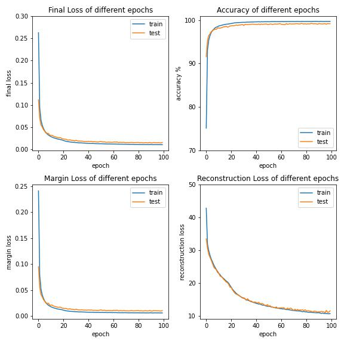
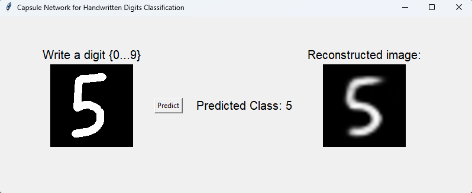

# Capsule Network in Pytorch

A Pytorch implementation of CapsNet based on Geoffrey Hinton's paper [Dynamic Routing Between Capsules](https://arxiv.org/abs/1710.09829)

## Requirements
- Python 3
- PyTorch
- Torchvision
- Pillow
- Opencv-python
- Tqdm 
- Matplotlib (for showing some inferences after training)

## Hyperparameters
The hyperparameters I used can be different from other authors' a bit. 
```
NUM_EPOCHS = 100
BATCH_SIZE = 128
- In the Encoder:
    LEARNING_RATE = 0.0003
    WEIGHT_DECAY = 0.0001
- In the Decoder:
    LEARNING_RATE = 0.001
```

## Model architecture
The architecture of the model was followed strictly as mentioned in the paper and was defined in [CapsNet.py](https://github.com/HoangPham3003/Capsule-Network-in-Pytorch/blob/main/CapsNet.py)

## Training Procedure
The training procedure can be followed up in the [MNIST_CapsuleNetwork.ipynb](https://github.com/HoangPham3003/Capsule-Network-in-Pytorch/blob/main/MNIST_CapsuleNetwork.ipynb)

## Benchmarks
Highest accuracy was 99.3% on the 85/100 epoch.
In this epoch, the Final Loss was 0.0151, in which Margin Loss was 0.0094 and Reconstruction Loss was 11.4979.
The best model was saved and can be found [here](https://github.com/HoangPham3003/Capsule-Network-in-Pytorch/tree/main/model)
The trend of loss and accuracy graphs were shown below.


## Inferences
A simple app was created by Tkinter for inferences.
The code in [run.py](https://github.com/HoangPham3003/Capsule-Network-in-Pytorch/blob/main/app.py) can be downloaded and run for inferences.


## References
Very thanks to some authors who have guidelines and implementations of CapsNet:
1. [TensorFlow implementation by @naturomics](https://github.com/naturomics/CapsNet-Tensorflow)
2. [Pytorch implementation by @gram-ai](https://github.com/gram-ai/capsule-networks)
3. [Detail guidelines in Tensorflow by @ageron](https://github.com/ageron/handson-ml/blob/master/extra_capsnets.ipynb)